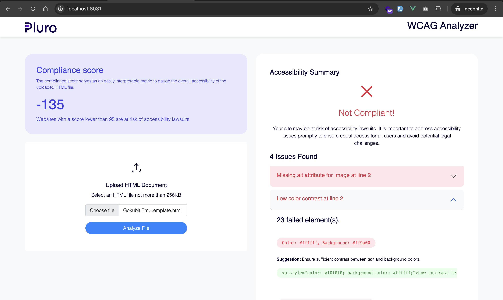

# WCAG Analyzer Frontend

A Vue 3 web application for analyzing HTML documents against Web Content Accessibility Guidelines (WCAG) standards.



## Features

- Upload HTML files for accessibility analysis
- View compliance scores and detailed reports
- Identify accessibility issues with suggested fixes
- Modern, responsive UI built with Bootstrap 5

## Tech Stack

- **Vue 3** - Composition API
- **Vite 6** - Build tool and dev server
- **Vue Router 4** - Client-side routing
- **Bootstrap 5** - UI components
- **Axios** - HTTP client

## Requirements

- Node.js 20+ (recommended: Node.js 24)
- npm 10+

## Installation

```bash
# Install dependencies
npm install

# Copy environment file and configure
cp .env.example .env
```

## Development

```bash
# Start development server
npm run dev
```

The app will be available at `http://localhost:3000`

## Production Build

```bash
# Build for production
npm run build

# Preview production build
npm run preview
```

## Environment Variables

| Variable            | Description     | Default                                   |
| ------------------- | --------------- | ----------------------------------------- |
| `VITE_API_BASE_URL` | Backend API URL | `https://wcag.backend.sixthflair.com/api` |

## Deployment

### Vercel

This project is configured for Vercel deployment with Node.js 24:

1. Connect your repository to Vercel
2. Set the `VITE_API_BASE_URL` environment variable in Vercel dashboard
3. Deploy

The `vercel.json` configuration handles:

- SPA routing (all routes serve `index.html`)
- Node.js 24 runtime
- Vite build output

## Project Structure

```
src/
├── assets/          # Static assets and CSS
├── components/      # Reusable Vue components
│   ├── issues/      # Issue-related components
│   └── layouts/     # Layout components
├── helpers/         # Utility functions and services
│   └── services/    # API service layer
├── router/          # Vue Router configuration
└── views/           # Page components
```

## License

Private
